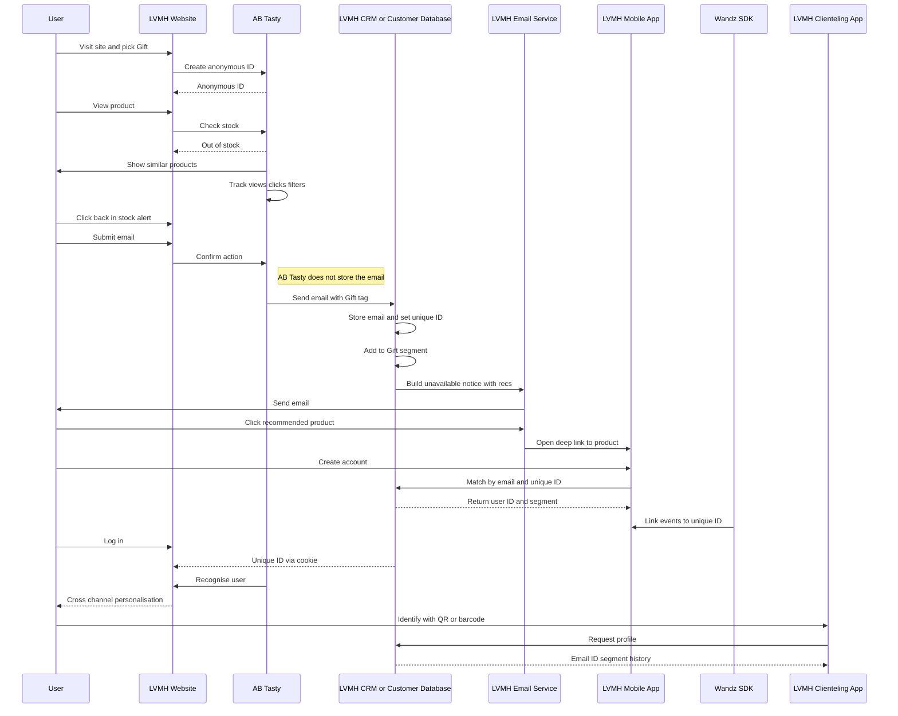

# LVMH Omnichannel Customer Journey and Data Flow

## Table of Contents
1. [Overview](#overview)
2. [Flowchart - Data Flow Between Systems](#flowchart---data-flow-between-systems)
3. [Sequence Diagram - Customer Journey Timeline](#sequence-diagram---customer-journey-timeline)
4. [Notes](#notes)

## Overview

This document illustrates the **LVMH omnichannel customer journey** and **data flow** across digital and in-store touchpoints.  
It highlights how **AB Tasty**, **CRM/Database from LVMH**, **Web**, the **LVMH mobile app** and **clienteling instore app** connect to deliver a consistent, GDPR-compliant experience.

## Flowchart - Data Flow Between Systems

The diagram below shows how user data travels across systems from the website visit to the in-store experience.

```mermaid
flowchart LR
  classDef hub fill:#eef,stroke:#77a,stroke-width:1px;
  classDef gdpr fill:#efe,stroke:#7a7,stroke-width:1px;
  classDef key fill:#ffe,stroke:#aa7,stroke-width:1px;

  %% Step 1 - LVMH Website visit
  subgraph S1[Step 1 • LVMH Website visit]
    A1[Anonymous User visit Gift category on LVMH site]
    A2[AB Tasty creates anonymous ID]
    A3[User views product]
    A4{Out of stock?}
    A5[AB Tasty show similar products carousel]
    A6[Track views • clicks • filters]
    A1 --> A2 --> A3 --> A4
    A4 -- Yes --> A5 --> A6
    A4 -- No --> A6
  end

  %% Step 2 - Back in stock alert
  subgraph S2[Step 2 • Back in stock alert on LVMH Website]
    B1[User ignores recs]
    B2[Clicks back in stock alert]
    B3[Submits email]
    B4[Gift tag attached to email payload]
    B1 --> B2 --> B3 --> B4
  end

  %% Step 3 - CRM/Database identification and email
  subgraph S3[Step 3 • LVMH CRM/Database identification and email]
    C1[CRM/Database or Customer Database stores email • sets unique ID]
    C2[User in Gift segment]
    C3[CRM Email Product still unavailable with AB Tasty recs from Step1]
    C4[User clicks a recommended Product from Email]
    C1 --> C2 --> C3 --> C4
  end

  %% Step 4 - LVMH Mobile app interaction
  subgraph S4[Step 4 • LVMH mobile app interaction]
    D1[User lands in mobile app]
    D2[Creates account]
    D3[Match email in LVMH CRM/Database]
    D4[Unique ID available on app account]
    D5[Wandz SDK links events to unique ID]
    D1 --> D2 --> D3 --> D4 --> D5
  end

  %% Step 5 - LVMH Web login
  subgraph S5[Step 5 • LVMH Web login]
    E1[User logs back on LVMH Web]
    E2[AB Tasty recognises logged in user via unique ID in cookie]
    E3[Cross channel personalisation achieved]
    E1 --> E2 --> E3
  end

  %% Step 6 - LVMH In store
  subgraph S6[Step 6 • LVMH in store]
    F1[User visits store • LVMH clienteling app]
    F2[Identifies via QR or barcode]
    F3[System fetches email • ID • segment • history]
    F1 --> F2 --> F3
  end

  %% LVMH CRM hub and keys
  H[(LVMH CRM or Customer Database hub)]
  class H hub
  K[Keys • Email • Unique ID • Segment Gift • QR or barcode • Account info]
  class K key

  %% Main flows
  A5 --> B1
  S2 --> S3
  S4 --> S5
  S5 --> S6
  C4 --> D1
  D3 --> H
  F3 --> H
  H --- K
```

## Sequence Diagram - Customer Journey Timeline

This sequence diagram follows the chronological customer journey and data exchanges between systems.

## Text Specifications

## Step 1 - LVMH Website Visit and Product Interaction
- An anonymous user visits the **LVMH website** and selects the **Gift** category.  
- AB Tasty generates an **anonymous ID** for the user.  
- The user applies filters and views an **out-of-stock product**.  
- AB Tasty displays a **carousel of similar products** on the LVMH site.  
- All user interactions (**page views, clicks, filters**) are tracked by AB Tasty.

## Step 2 - Back-in-Stock Alert on LVMH Website
- The user ignores recommendations.  
- They click **“Send me an alert when back in stock”** and enter their email.  
- AB Tasty tracks the confirmation action but **does not store the email** for GDPR compliance.  

**Technical detail:**  
- AB Tasty attaches the **“Gift” segment tag** to the email payload before sending to **LVMH CRM**.

## Step 3 - LVMH CRM Identification and Email Trigger
- The **LVMH CRM** stores the submitted email and assigns a **unique ID** to the user.  
- The user is categorised in the **“Gift” segment**.  
- Later, the LVMH CRM sends an **email notification** that the product is still unavailable.  
- The email includes **AB Tasty product recommendations**.  
- The user clicks a **recommended product link** in the email.

## Step 4 - LVMH Mobile App Interaction
- The user lands in the **LVMH mobile app** after clicking the email link.  
- They **create an account** in the app.  
- The app and LVMH CRM **match the user** using:  
  - The **email** from Step 2.  
  - The **unique ID** from Step 3, attached through state, variable, or local storage.  
- The **Wandz SDK** collects events and segments, linking them to the **unique ID**.  

**GDPR requirements:**  
- Data stored only in the **EU**.  
- User **consent** managed per GDPR.  
- Legal **clauses** defined in the client contract.

## Step 5 - LVMH Web Login
- When the user logs in on the **LVMH website**, **AB Tasty recognises** them.  
- The **unique ID** from the LVMH CRM is made available via a **cookie**.  
- Enables **cross-channel personalisation** between web and app.

## Step 6 - LVMH In-Store Interaction
- The user visits an **LVMH physical store** using a **clienteling app** connected to the LVMH CRM.  
- They identify themselves using a **QR code or barcode**.  
- The system retrieves their **email, ID, segment, and history**.

## Database and CRM Implications
**Key identifiers across all systems:**
- Email address  
- Unique ID  
- Segment tag such as **“Gift”**  
- QR code or barcode  
- Account information  

**LVMH CRM/Database role:**  
Acts as the **central hub** connecting the **LVMH website**, **LVMH mobile app**, **AB Tasty and Wandz**, and **LVMH store interactions**.

## Development Requirements such as Implementation
- Deploy **AB Tasty web JavaScript tag** on LVMH web.  
- Implement **product recommendation strategies** on LVMH web and email.  
- Store **unique ID** linked to LVMH CRM email in:  
  - Web **cookie**  
  - App **state, variable, or local storage**
- Ensure **“Gift” category tag** and **email payload** are transmitted correctly to **LVMH CRM/Database**.  
- Generate and maintain **unique IDs** in the **LVMH CRM/Database**.

## Notes
- **AB Tasty** manages anonymous tracking, product recommendations and cross-channel ID linking.  
- **LVMH CRM/Database** is the central hub connecting website, app and store.  
- **Wandz SDK** gathers in-app events and segments for personalisation.  
- **GDPR compliance** ensures data remains within the EU with explicit consent management.

