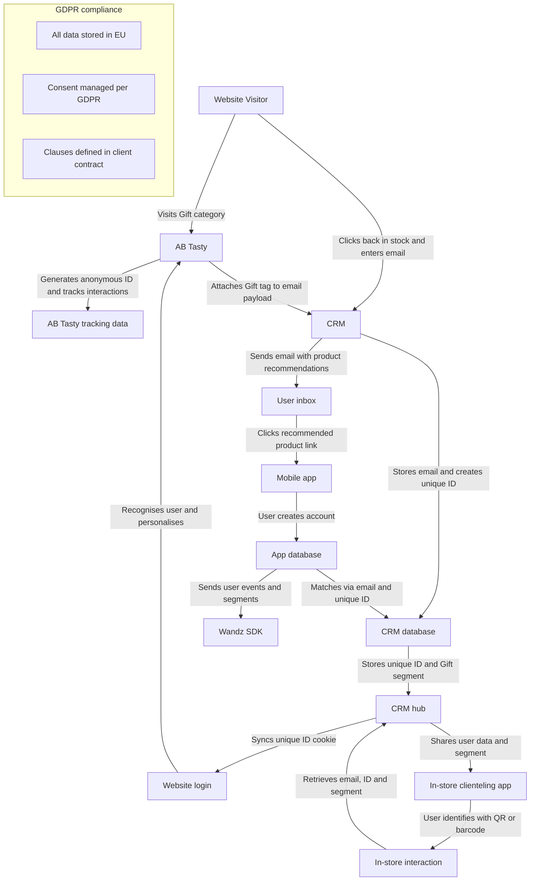
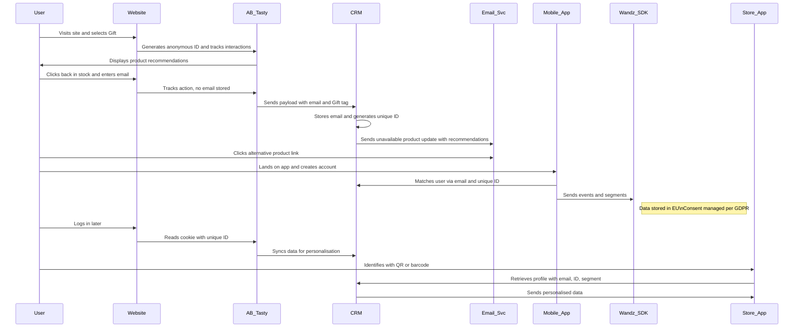

# Omnichannel Customer Journey and Data Flow

## Table of Contents
1. [Overview](#overview)
2. [Flowchart – Data Flow Between Systems](#flowchart--data-flow-between-systems)
3. [Sequence Diagram – Customer Journey Timeline](#sequence-diagram--customer-journey-timeline)
4. [Notes](#notes)
5. [How to View Locally](#how-to-view-locally)

## Overview

This document illustrates the **Omnichannel customer journey** and **data flow** across digital and in-store touchpoints.  
It highlights how AB Tasty, CRM systems, the mobile app and clienteling connect to deliver a consistent, GDPR-compliant experience.

## Flowchart – Data Flow Between Systems

The diagram below shows how user data travels across systems from the website visit to the in-store experience.

## Sequence Diagram – Customer Journey Timeline

This sequence diagram follows the chronological customer journey and data exchanges between systems.

# LVMH – Omnichannel Customer Journey and Data Flow (Clean Version)

## Step 1 – Website Visit and Product Interaction
- An anonymous user visits the website and selects the **Gift** category.  
- AB Tasty generates an **anonymous ID** for the user.  
- The user applies filters and views an **out-of-stock product**.  
- AB Tasty displays a **carousel of similar products** (same category, similar price, tagged “gift”).  
- All user interactions (**page views, clicks, filters**) are tracked by AB Tasty.

---

## Step 2 – Back-in-Stock Alert
- The user ignores recommendations.  
- They click **“Send me an alert when back in stock”** and enter their email.  
- AB Tasty tracks the confirmation action but **does not store the email** (GDPR compliance).  

**Technical detail:**  
- AB Tasty attaches the **“Gift” segment tag** to the email payload before sending to CRM.

---

## Step 3 – CRM Identification and Email Trigger
- The **CRM** stores the submitted email and assigns a **unique ID** to the user.  
- The user is categorised in the **“Gift” segment**.  
- Later, the CRM sends an **email notification** that the product is still unavailable.  
- The email includes **AB Tasty product recommendations** (similar to Step 1).  
- The user clicks a **recommended product link** in the email.

---

## Step 4 – Mobile App Interaction
- The user lands in the **mobile app** after clicking the email link.  
- They **create an account** in the app.  
- The app and CRM **match the user** using:  
  - The **email** from Step 2.  
  - The **unique ID** from Step 3, attached through state, variable, or local storage.  
- The **Wandz SDK** collects events and segments, linking them to the **unique ID**.  

**GDPR requirements:**  
- Data stored only in the **EU**.  
- User **consent** managed per GDPR.  
- Legal **clauses** defined in client contract.

---

## Step 5 – Web Login
- When the user logs in on the website, **AB Tasty recognises** them.  
- The **unique ID** from the CRM is made available via a **cookie**.  
- Enables **cross-channel personalisation** between web and app.

---

## Step 6 – In-Store Interaction
- The user visits a **physical store** using a **clienteling app** connected to the CRM.  
- They identify themselves using a **QR code or barcode**.  
- The system retrieves their **email, ID, segment, and history**.

---

## Database and CRM Implications
**Key identifiers across all systems:**
- Email address  
- Unique ID  
- Segment tag (e.g. “Gift”)  
- QR code / barcode  
- Account information  

**CRM role:**  
Acts as the **central hub** connecting the **website**, **mobile app**, **AB Tasty/Wandz**, and **store interactions**.

---

## Development Requirements (LVMH Implementation)
- Deploy **AB Tasty web JavaScript tag**.  
- Implement **product recommendation strategies** on web and email.  
- Store **unique ID** linked to CRM email in:  
  - Web **cookie**  
  - App **state, variable, or local storage**  
- Ensure **“Gift” category tag** and **email payload** are transmitted correctly to CRM.  
- Generate and maintain **unique IDs** in the CRM.

## Notes
- **AB Tasty** manages anonymous tracking, product recommendations and cross-channel ID linking.  
- **CRM** is the central hub connecting website, app and store.  
- **Wandz SDK** gathers in-app events and segments for personalisation.  
- **GDPR compliance** ensures data remains within the EU with explicit consent management.
